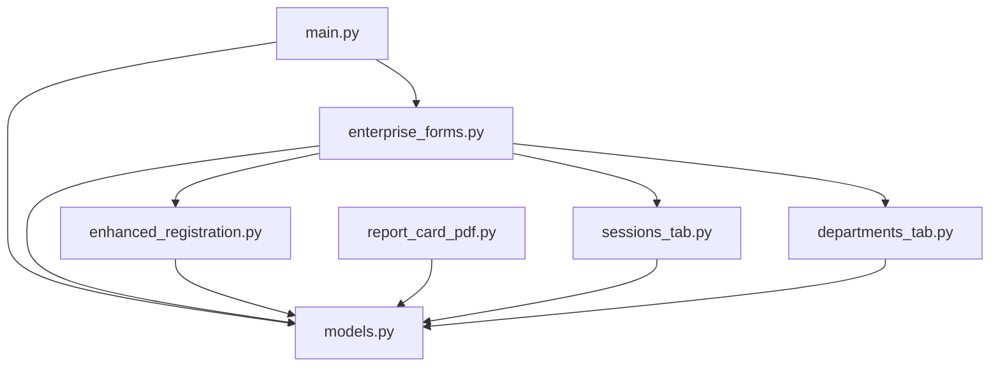
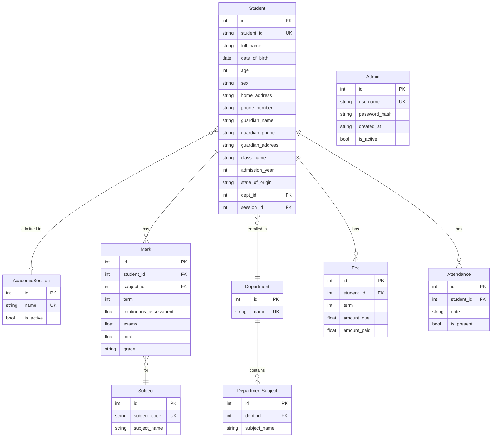

# Design Document: GFA Admin Panel Improvements

## Overview

This document describes the technical design for a set of improvements to the GFA Admin Panel desktop application. The app is built with Python, customtkinter, SQLAlchemy (SQLite), and ReportLab. The improvements span branding, UI restyling, login UX, year selection, admission number integrity, phone validation, keyboard navigation, academic session management, PDF export quality, and a new department/subject schema.

All changes are backward-compatible with the existing SQLite database via SQLAlchemy's `create_all` (new columns require Alembic or manual migration).

## Architecture

The application follows a single-process desktop MVC pattern:

```
main.py              — entry point, LoginWindow, app bootstrap
models.py            — SQLAlchemy ORM models (data layer)
enterprise_forms.py  — main tabbed admin panel (view/controller)
enhanced_registration.py — student registration form (view/controller)
report_card_pdf.py   — PDF generation (service)
calculations.py      — grade/position logic (service)
ui_components.py     — shared UI helpers (view utilities)
student_details_windows.py — student detail modals (view)
enhanced_broadsheet.py     — broadsheet tab (view/controller)
forms.py             — marks/broadsheet tabs (view/controller)
```

New files introduced by this design:

```
sessions_tab.py      — SessionsTab widget (new)
departments_tab.py   — DepartmentsTab widget (new)
```


### Dependency Graph (simplified)



## Components and Interfaces

### Req 1 & 2 — Branding and UI Restyling (`main.py`, `enterprise_forms.py`, `enhanced_registration.py`, `ui_components.py`)

**Changes:**
- Update `COLORS` dict in all files to use white background and blue accents.
- Replace `ctk.set_appearance_mode("dark")` with `"light"` in `main.py`.
- Update all hardcoded title/header strings to "GFA Admin Panel" / "GFA".
- Update `TextLabelManager.HEADERS` in `ui_components.py` to reflect GFA branding.

**Updated COLORS dict (shared across all files):**
```python
COLORS = {
    "primary":        "#1a73e8",
    "primary_hover":  "#1557b0",
    "bg_main":        "#ffffff",
    "bg_card":        "#f8f9fa",
    "text_primary":   "#202124",
    "text_secondary": "#5f6368",
    "border":         "#dadce0",
    "success":        "#34a853",
    "warning":        "#fbbc04",
    "danger":         "#ea4335",
}
```

The `bg_dark` key is removed; all frames previously using `bg_dark` switch to `bg_main`.

### Req 3 — Login Button (`main.py` → `LoginWindow`)

The `LoginWindow.setup_ui()` already creates a `CTkButton` with `command=self.attempt_login`. The existing code is correct. The fix is:
- Rename the window title from `"School Management System - Login"` to `"GFA Admin Panel"`.
- Update the header label from `"School Management System"` to `"GFA Admin Panel"`.
- Ensure the button exists and is visible (already present in current code).

No new method is needed; `attempt_login` is already the shared handler for both Enter key and button click.

### Req 4 — Infinite Year Scroll (`enhanced_registration.py`)

Replace the `CTkComboBox` year selector with a custom `YearSpinner` widget.

**`YearSpinner` interface:**
```python
class YearSpinner(ctk.CTkFrame):
    def __init__(self, parent, initial_year: int, on_change: Callable[[int], None], **kwargs)
    def get(self) -> int          # returns current year as int
    def set(self, year: int)      # sets year programmatically
    def _increment(self)          # year += 1, calls on_change
    def _decrement(self)          # year -= 1, calls on_change
```

Layout: `[▲]  [year label]  [▼]` — three widgets packed horizontally. No min/max bounds. The `on_change` callback replaces `update_student_id_preview`.


### Req 5 — Admission Number Integrity (`enhanced_registration.py`)

**Root cause of "J" injection:** `update_student_id_preview` uses `year[-2:]` on the string from the old `CTkComboBox`, which could produce unexpected characters if the variable is in a bad state. With the new `YearSpinner` (which always holds an `int`), this is eliminated.

**Key algorithm — 4-digit sequential ID generation:**
```python
def next_admission_number(session, year_suffix: str) -> str:
    """
    Find the highest existing sequential number for a given YY prefix
    and return the next one, zero-padded to 4 digits.
    e.g. if GFA/24/S0003 exists, returns "0004"
    """
    prefix = f"GFA/{year_suffix}/S"
    existing = (
        session.query(Student.student_id)
        .filter(Student.student_id.like(f"{prefix}%"))
        .all()
    )
    max_num = 0
    for (sid,) in existing:
        try:
            num = int(sid[len(prefix):])
            max_num = max(max_num, num)
        except ValueError:
            pass
    return f"{max_num + 1:04d}"
```

**ID prefix label** always shows `GFA/{YY}/S` (never `GFA/{YY}/J`). The `update_student_id_preview` method is replaced by `_on_year_change(year: int)` which sets:
```python
self.id_prefix_label.configure(text=f"GFA/{str(year)[-2:]}/S")
```

**Validation at submit:** `student_id = f"GFA/{year_suffix}/S{id_number:04d}"` where `id_number` is auto-generated or entered as a 4-digit integer.

The hint text changes from `"(Enter 3-digit number)"` to `"(auto-filled)"` since the number is auto-generated; the entry becomes read-only and pre-populated by `next_admission_number()`.

### Req 6 — Phone Validation (`enhanced_registration.py`)

**Real-time validation** is attached via `textvariable` trace on both `phone_entry` and `guardian_phone_entry`.

**Algorithm:**
```python
def _validate_phone(self, field: str, value: str):
    """Called on every keystroke via StringVar trace."""
    error_label = self.phone_error_label if field == "phone" else self.guardian_phone_error_label
    if len(value) > 11:
        error_label.configure(text="Value is not allowed")
        self._phone_valid[field] = False
    else:
        error_label.configure(text="")
        self._phone_valid[field] = True
```

`self._phone_valid` is a dict `{"phone": True, "guardian_phone": True}` initialized in `__init__`. The `add_student` method checks both flags before proceeding:
```python
if not all(self._phone_valid.values()):
    return  # errors already shown inline
```

No truncation occurs — the raw value is stored as-is (blocked at submit if invalid).

### Req 7 — Keyboard Navigation (`enhanced_registration.py`)

After all `CTkEntry` widgets are created, collect them into an ordered list `self._tab_order`. Then bind `<Shift-Tab>` on each:

```python
def _bind_tab_order(self):
    self._tab_order = [
        self.name_entry,
        self.id_number_entry,
        self.phone_entry,
        self.guardian_name_entry,
        self.guardian_phone_entry,
    ]
    for i, widget in enumerate(self._tab_order):
        prev = self._tab_order[i - 1]  # wraps around at index 0
        widget.bind("<Shift-Tab>", lambda e, p=prev: (p.focus_set(), "break"))
```

Returning `"break"` prevents the default Shift+Tab behavior from also firing. Forward Tab is not overridden (default tkinter behavior is preserved).


### Req 8 — Session Management

#### New model: `AcademicSession` (`models.py`)

```python
class AcademicSession(Base):
    __tablename__ = 'academic_sessions'
    id         = Column(Integer, primary_key=True)
    name       = Column(String(20), unique=True, nullable=False)  # e.g. "2024/2025"
    is_active  = Column(Boolean, default=False, nullable=False)
```

#### New tab: `SessionsTab` (`sessions_tab.py`)

**Layout:**
```
┌─────────────────────────────────────────────────────┐
│  Academic Sessions                    [+ New Session]│
├─────────────────────────────────────────────────────┤
│  Session Name    │  Status    │  Actions             │
│  2024/2025       │  ● Active  │  [Set Active][Delete]│
│  2023/2024       │  Inactive  │  [Set Active][Delete]│
└─────────────────────────────────────────────────────┘
```

**Key methods:**
```python
class SessionsTab(ctk.CTkFrame):
    def load_sessions(self)
    def create_session(self, name: str)   # validates format, persists
    def set_active(self, session_id: int) # clears all is_active, sets one
    def delete_session(self, session_id: int)
    def _validate_session_name(self, name: str) -> bool
```

**Session name validation algorithm:**
```python
import re
SESSION_PATTERN = re.compile(r'^(\d{4})/(\d{4})$')

def _validate_session_name(self, name: str) -> bool:
    m = SESSION_PATTERN.match(name)
    if not m:
        return False
    start, end = int(m.group(1)), int(m.group(2))
    return end == start + 1
```

**Set-active invariant:** Before setting `session.is_active = True`, execute:
```python
db.query(AcademicSession).update({"is_active": False})
```
This guarantees at most one active session at all times.

#### Registration form changes (`enhanced_registration.py`)

- Replace `YearSpinner` with a `CTkComboBox` populated from `AcademicSession` records.
- `_on_session_change(session_name: str)`: parses `session_name[:4]` to get start year, derives `YY = session_name[2:4]`, updates prefix label.
- `next_admission_number` uses the derived `YY` from the selected session.
- Students list in `StudentsListTab` sorts by `Student.student_id` (lexicographic, which is correct for `GFA/YY/SXXXX` format).

#### `EnterpriseSchoolManagementApp` changes (`enterprise_forms.py`)

Add `SessionsTab` as a new tab in the main `CTkTabview`.

### Req 9 — PDF Export Quality (`report_card_pdf.py`)

**Problems in current code:**
1. No `KeepTogether` — the grades table can split across pages mid-row.
2. Column widths sum to `2.5 + 1 + 1 + 1 + 0.8 = 7.3 inches` but A4 usable width is ~6.27 inches — content overflows.
3. No explicit page break between student info and grades sections.
4. Summary and signature sections can be orphaned on a new page without their context.

**Fix strategy:**

```python
from reportlab.platypus import KeepTogether, PageBreak

# Corrected column widths (total = 6.27 inches = A4 usable width with 0.75in margins)
GRADE_COL_WIDTHS = [2.8*inch, 0.9*inch, 0.9*inch, 0.9*inch, 0.77*inch]
INFO_COL_WIDTHS  = [1.4*inch, 1.87*inch, 1.4*inch, 1.6*inch]
```

**Story construction with KeepTogether:**
```python
# Group header + student info as one unbreakable block
header_block = KeepTogether([
    Paragraph("GFA Admin Panel", title_style),
    Paragraph("STUDENT REPORT CARD", heading_style),
    Spacer(1, 0.2*inch),
    info_table,
])
story.append(header_block)

# Grades section — keep heading + table together
grades_block = KeepTogether([
    Paragraph("Academic Performance", heading_style),
    grades_table,
])
story.append(grades_block)

# Summary + signature — keep together
summary_block = KeepTogether([
    summary_table,
    Spacer(1, 0.4*inch),
    Paragraph("Administrative Approval", heading_style),
    signature_table,
])
story.append(summary_block)
```

If the grades table is very long (>15 subjects), `KeepTogether` will still allow it to break — that is acceptable and correct ReportLab behavior (it only prevents orphan headings).

**Header text** updated from `"SCHOOL MANAGEMENT SYSTEM"` to `"GFA Admin Panel"`.


### Req 10 — Department Model

#### New models (`models.py`)

```python
class Department(Base):
    __tablename__ = 'departments'
    id   = Column(Integer, primary_key=True)
    name = Column(String(50), unique=True, nullable=False)  # "Science" | "Art" | "Commercial"
    subjects = relationship("DepartmentSubject", back_populates="department",
                            cascade="all, delete-orphan")

class DepartmentSubject(Base):
    __tablename__ = 'department_subjects'
    id          = Column(Integer, primary_key=True)
    dept_id     = Column(Integer, ForeignKey('departments.id'), nullable=False)
    subject_name = Column(String(100), nullable=False)
    department  = relationship("Department", back_populates="subjects")
    __table_args__ = (UniqueConstraint('dept_id', 'subject_name', name='_dept_subject_uc'),)
```

#### `Student` model update (`models.py`)

Add a nullable foreign key (nullable to preserve existing records):
```python
dept_id = Column(Integer, ForeignKey('departments.id'), nullable=True)
department = relationship("Department")
```

#### Pre-seeding (`main.py` → `initialize_departments()`)

```python
DEPARTMENT_DEFAULTS = {
    "Science":    ["English Language", "Mathematics", "Physics", "Chemistry",
                   "Biology", "Agricultural Science", "Further Mathematics",
                   "Geography", "Data Processing"],
    "Art":        ["English Language", "Mathematics", "Civic Education",
                   "Economics", "Geography", "Food and Nutrition",
                   "Literature in English", "Government", "History"],
    "Commercial": ["English Language", "Mathematics", "Civic Education",
                   "Economics", "Commerce", "Financial Accounting",
                   "Data Processing", "Business Studies", "Office Practice"],
}

def initialize_departments():
    session = Session()
    if session.query(Department).count() == 0:
        for dept_name, subjects in DEPARTMENT_DEFAULTS.items():
            dept = Department(name=dept_name)
            session.add(dept)
            session.flush()
            for s in subjects:
                session.add(DepartmentSubject(dept_id=dept.id, subject_name=s))
        session.commit()
    session.close()
```

Called in `main.py` alongside `initialize_subjects()` and `initialize_admin()`.

#### New tab: `DepartmentsTab` (`departments_tab.py`)

**Layout:**
```
┌──────────────────────────────────────────────────────────────┐
│  Departments & Subjects                                       │
├──────────────────────────────────────────────────────────────┤
│  [Science ▼]  [Art ▼]  [Commercial ▼]   ← tab selector      │
├──────────────────────────────────────────────────────────────┤
│  Subjects in Science:              [+ Add Subject]           │
│  ┌──────────────────────────────────────────────────────┐   │
│  │  #  │  Subject Name              │  Actions          │   │
│  │  1  │  English Language          │  [Edit] [Remove]  │   │
│  │  2  │  Mathematics               │  [Edit] [Remove]  │   │
│  └──────────────────────────────────────────────────────┘   │
└──────────────────────────────────────────────────────────────┘
```

**Key methods:**
```python
class DepartmentsTab(ctk.CTkFrame):
    def load_department(self, dept_name: str)
    def add_subject(self, dept_id: int, subject_name: str)
    def edit_subject(self, subject_id: int, new_name: str)
    def remove_subject(self, subject_id: int)
```

#### Registration form changes (`enhanced_registration.py`)

Add a `CTkComboBox` for department selection (values: `["Science", "Art", "Commercial"]`). On submit, resolve `dept_id` from the selected name and store on the `Student` record.

#### `EnterpriseSchoolManagementApp` changes (`enterprise_forms.py`)

Add `DepartmentsTab` as a new tab in the main `CTkTabview`.

## Data Models

### Updated ERD



### Migration notes

Since SQLAlchemy's `Base.metadata.create_all` only creates missing tables (does not add columns to existing tables), the two new columns on `Student` (`dept_id`, `session_id`) require one of:
- A one-time migration script using `ALTER TABLE students ADD COLUMN dept_id INTEGER` and `ALTER TABLE students ADD COLUMN session_id INTEGER`.
- Or wrapping `create_all` with a manual column-existence check on startup.

Recommended approach: add a `run_migrations()` function in `models.py` that uses `PRAGMA table_info` to check and add missing columns.


## Correctness Properties

*A property is a characteristic or behavior that should hold true across all valid executions of a system — essentially, a formal statement about what the system should do. Properties serve as the bridge between human-readable specifications and machine-verifiable correctness guarantees.*

### Property 1: Unbounded year spinner

*For any* integer year value, calling increment on the `YearSpinner` should produce `year + 1`, and calling decrement should produce `year - 1`, with no upper or lower bound enforced.

**Validates: Requirements 4.1, 4.2**

---

### Property 2: Student ID prefix always ends in "S"

*For any* integer year value passed to `_on_year_change`, the resulting prefix label text should match the pattern `GFA/\d{2}/S` and must not contain the character "J".

**Validates: Requirements 5.1, 5.3**

---

### Property 3: Student ID format correctness

*For any* session name in `YYYY/YYYY+1` format and any positive integer sequential number, the constructed `student_id` string should match the regex `^GFA/\d{2}/S\d{4}$`.

**Validates: Requirements 5.2**

---

### Property 4: 4-digit zero-padding

*For any* integer `n` in the range 1–9999, `f"{n:04d}"` should produce a string of exactly 4 characters where all leading positions are zero-padded.

**Validates: Requirements 5.5**

---

### Property 5: Phone validation correctness

*For any* string `s`, the phone validation function should return an error if and only if `len(s) > 11`. For strings with `len(s) <= 11` no error is shown; for strings with `len(s) > 11` the error "Value is not allowed" is shown.

**Validates: Requirements 6.1, 6.3**

---

### Property 6: Session name validation

*For any* string, `_validate_session_name` should return `True` if and only if the string matches `YYYY/YYYY+1` (i.e. two 4-digit years separated by `/` where the second is exactly one more than the first), and `False` otherwise.

**Validates: Requirements 8.3**

---

### Property 7: At most one active session

*For any* sequence of `set_active(session_id)` calls on a database containing any number of sessions, after each call exactly one session should have `is_active = True` and all others should have `is_active = False`.

**Validates: Requirements 8.4**

---

### Property 8: Session YY derivation

*For any* valid session name `YYYY/YYYY+1`, the derived `YY` value should equal `str(YYYY)[2:]` (the last two digits of the start year).

**Validates: Requirements 8.6**

---

### Property 9: Student sort by matric number

*For any* list of students retrieved from the database ordered by `student_id`, the resulting list should be in ascending lexicographic order of `student_id` strings, which for the `GFA/YY/SXXXX` format is equivalent to chronological then sequential order.

**Validates: Requirements 8.7**

---

### Property 10: PDF contains all student fields

*For any* student record with at least one mark, the text content of the generated PDF should contain the student's full name, student ID, class name, and all subject names from their mark records.

**Validates: Requirements 9.1, 9.5**

---

### Property 11: PDF pagination for large mark sets

*For any* student with more than 15 subject marks (enough to overflow one A4 page), the generated PDF should have a page count greater than 1.

**Validates: Requirements 9.3**

---

### Property 12: Department subject CRUD round-trip

*For any* department and any subject name, adding a subject to the department and then querying `DepartmentSubject` for that department should include the added subject. Editing the subject name should result in the new name being stored. Removing the subject should result in it no longer appearing in the query results.

**Validates: Requirements 10.2, 10.4, 10.5**

---

### Property 13: Student department association persists

*For any* student registration with a selected department, querying the stored `Student` record should return a `dept_id` matching the selected department's `id`.

**Validates: Requirements 10.7**


## Error Handling

| Scenario | Location | Handling |
|---|---|---|
| Duplicate `student_id` on insert | `enhanced_registration.py` | Catch `IntegrityError`, show inline error under ID field |
| Invalid session format | `sessions_tab.py` | Show inline error label, do not persist |
| Duplicate session name | `sessions_tab.py` | Catch `IntegrityError`, show inline error |
| Phone > 11 chars | `enhanced_registration.py` | Real-time inline error, block submit |
| PDF generation failure | `report_card_pdf.py` | Return `False`, caller shows `messagebox.showerror` |
| Missing student/marks for PDF | `report_card_pdf.py` | Return `False` early |
| DB migration column already exists | `models.py` `run_migrations()` | Catch `OperationalError`, continue silently |
| Department subject duplicate | `departments_tab.py` | Catch `IntegrityError`, show inline error |

## Testing Strategy

### Unit Tests

Unit tests cover specific examples, edge cases, and error conditions. They should be placed in a `tests/` directory.

**Recommended test cases:**
- `test_branding.py`: Assert window title equals "GFA Admin Panel"; assert COLORS["bg_main"] == "#ffffff"; assert appearance mode is "light".
- `test_login.py`: Assert login button exists and its `command` is `attempt_login`; assert Enter key binding calls `attempt_login`.
- `test_session_tab.py`: Assert `SessionsTab` widget is present in the tab view; assert department selector appears in registration form.
- `test_departments.py`: Assert exactly 3 departments after `initialize_departments()`; assert each has the correct default subjects.
- `test_keyboard_nav.py`: Assert `<Shift-Tab>` binding exists on all `CTkEntry` widgets in the registration form.

### Property-Based Tests

Use **Hypothesis** (Python property-based testing library) for all property tests. Configure each test with `@settings(max_examples=100)`.

Each test is tagged with a comment referencing the design property.

```python
# Feature: gfa-admin-panel-improvements, Property 1: Unbounded year spinner
@given(st.integers())
@settings(max_examples=100)
def test_year_spinner_unbounded(year):
    spinner = YearSpinner(None, year, lambda y: None)
    spinner._increment()
    assert spinner.get() == year + 1
    spinner._decrement()
    spinner._decrement()
    assert spinner.get() == year - 1

# Feature: gfa-admin-panel-improvements, Property 2: Student ID prefix always ends in S
@given(st.integers(min_value=1900, max_value=2100))
@settings(max_examples=100)
def test_id_prefix_ends_in_s(year):
    yy = str(year)[-2:]
    prefix = f"GFA/{yy}/S"
    assert prefix.endswith("/S")
    assert "J" not in prefix

# Feature: gfa-admin-panel-improvements, Property 3: Student ID format
@given(st.from_regex(r'20\d{2}/20\d{2}', fullmatch=True), st.integers(min_value=1, max_value=9999))
@settings(max_examples=100)
def test_student_id_format(session_name, seq_num):
    yy = session_name[2:4]
    student_id = f"GFA/{yy}/S{seq_num:04d}"
    assert re.match(r'^GFA/\d{2}/S\d{4}$', student_id)

# Feature: gfa-admin-panel-improvements, Property 4: 4-digit zero-padding
@given(st.integers(min_value=1, max_value=9999))
@settings(max_examples=100)
def test_zero_padding(n):
    padded = f"{n:04d}"
    assert len(padded) == 4
    assert padded.isdigit()

# Feature: gfa-admin-panel-improvements, Property 5: Phone validation
@given(st.text(min_size=0, max_size=20))
@settings(max_examples=100)
def test_phone_validation(phone):
    error = validate_phone(phone)  # returns error string or ""
    if len(phone) > 11:
        assert error == "Value is not allowed"
    else:
        assert error == ""

# Feature: gfa-admin-panel-improvements, Property 6: Session name validation
@given(st.text())
@settings(max_examples=100)
def test_session_name_validation(name):
    result = validate_session_name(name)
    m = re.match(r'^(\d{4})/(\d{4})$', name)
    if m and int(m.group(2)) == int(m.group(1)) + 1:
        assert result is True
    else:
        assert result is False

# Feature: gfa-admin-panel-improvements, Property 7: At most one active session
@given(st.lists(st.integers(min_value=1, max_value=10), min_size=1, max_size=5))
@settings(max_examples=100)
def test_single_active_session(session_ids):
    # Uses in-memory SQLite DB
    for sid in session_ids:
        set_active(sid)
    active = db.query(AcademicSession).filter_by(is_active=True).all()
    assert len(active) == 1

# Feature: gfa-admin-panel-improvements, Property 8: Session YY derivation
@given(st.integers(min_value=2000, max_value=2099))
@settings(max_examples=100)
def test_session_yy_derivation(start_year):
    session_name = f"{start_year}/{start_year + 1}"
    yy = derive_yy(session_name)
    assert yy == str(start_year)[2:]

# Feature: gfa-admin-panel-improvements, Property 9: Student sort by matric number
@given(st.lists(st.from_regex(r'GFA/\d{2}/S\d{4}', fullmatch=True), min_size=1, max_size=20))
@settings(max_examples=100)
def test_student_sort_order(student_ids):
    sorted_ids = sorted(student_ids)
    assert sorted_ids == sorted(student_ids)  # idempotent sort

# Feature: gfa-admin-panel-improvements, Property 12: Department subject CRUD round-trip
@given(st.sampled_from(["Science", "Art", "Commercial"]), st.text(min_size=1, max_size=50))
@settings(max_examples=100)
def test_department_subject_crud(dept_name, subject_name):
    # add
    add_subject(dept_name, subject_name)
    assert subject_exists(dept_name, subject_name)
    # edit
    new_name = subject_name + "_edited"
    edit_subject(dept_name, subject_name, new_name)
    assert subject_exists(dept_name, new_name)
    assert not subject_exists(dept_name, subject_name)
    # remove
    remove_subject(dept_name, new_name)
    assert not subject_exists(dept_name, new_name)

# Feature: gfa-admin-panel-improvements, Property 13: Student department association persists
@given(st.sampled_from([1, 2, 3]))  # dept IDs after seeding
@settings(max_examples=100)
def test_student_dept_association(dept_id):
    student = register_student(dept_id=dept_id, ...)
    stored = db.query(Student).filter_by(student_id=student.student_id).first()
    assert stored.dept_id == dept_id
```

Properties 10 and 11 (PDF content and pagination) are tested as unit tests rather than property tests due to the overhead of PDF generation:
- `test_pdf_fields`: Generate a PDF for a known student, parse with `pdfminer`, assert all fields present.
- `test_pdf_pagination`: Generate a PDF for a student with 16 subjects, assert page count > 1.
