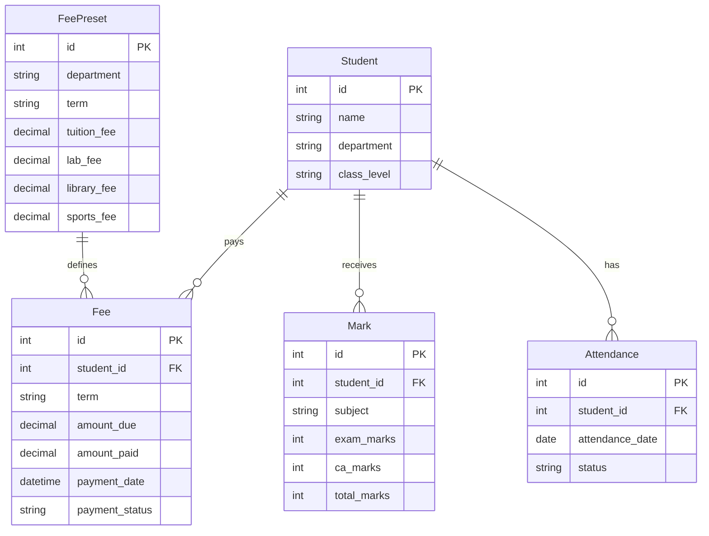

# Design Document: School Management System UX Improvements

## Overview

This design addresses critical user experience improvements for a Python tkinter/customtkinter-based school management system. The improvements focus on creating a professional, text-based interface while enhancing core workflows for student management, fee collection, marks entry, and attendance tracking.

The design leverages modern UI patterns adapted for desktop applications, emphasizing clarity, consistency, and professional appearance. Key improvements include replacing emoji icons with text labels, implementing modal-based student views, streamlining fee management with preset configurations, and modernizing the attendance system with proper date selection widgets.

## Architecture

### UI Framework Architecture

The system maintains its existing Python tkinter/customtkinter foundation while implementing enhanced UI patterns:

```
┌─────────────────────────────────────────┐
│           Main Application Window        │
├─────────────────────────────────────────┤
│  ┌─────────────────────────────────────┐ │
│  │        Navigation Frame             │ │
│  │  [Students] [Marks] [Attendance]    │ │
│  │  [Fees] [Reports]                   │ │
│  └─────────────────────────────────────┘ │
│  ┌─────────────────────────────────────┐ │
│  │        Content Frame                │ │
│  │  • Student List View               │ │
│  │  • Marks Entry Forms               │ │
│  │  • Attendance Interface            │ │
│  │  • Fee Management                  │ │
│  └─────────────────────────────────────┘ │
└─────────────────────────────────────────┘
         │
         ▼
┌─────────────────────────────────────────┐
│           Modal Windows                 │
├─────────────────────────────────────────┤
│  • Student Detail Modal                │
│  • Attendance Records Modal            │
│  • Results View Modal                  │
│  • Fee Payment Modal                   │
└─────────────────────────────────────────┘
```

### Component Separation

The design maintains clear separation between:
- **Presentation Layer**: CustomTkinter widgets with professional styling
- **Business Logic**: Core functionality for student management, calculations
- **Data Layer**: SQLAlchemy ORM with enhanced schema
- **Modal Management**: Dedicated modal controller for popup windows

## Components and Interfaces

### 1. Professional Text-Based Interface System

**TextLabelManager Component**
- Centralizes all text labels and button descriptions
- Provides consistent terminology across the application
- Supports easy localization if needed in the future

**Key Interface Changes:**
- Replace emoji-based buttons (📝, 👁️, 🗑️) with descriptive text
- Standardize button labels: "Edit", "View Details", "Delete", "Add New"
- Implement consistent typography hierarchy

### 2. Modal Window System

**ModalController Component**
```python
class ModalController:
    def open_student_detail_modal(student_id: int) -> None
    def open_attendance_modal(student_id: int) -> None  
    def open_results_modal(student_id: int) -> None
    def close_current_modal() -> None
```

**Modal Window Specifications:**
- Standard size: 800x600 pixels for desktop
- Centered positioning over parent window
- Semi-transparent overlay (0.3 opacity) behind modal
- Clear close button (X) in top-right corner
- Keyboard support (ESC to close)

**Student Detail Modal Structure:**
```
┌─────────────────────────────────────────┐
│  Student Details - [Student Name]    X │
├─────────────────────────────────────────┤
│  ┌─────────────────────────────────────┐ │
│  │     [View Attendance Records]       │ │
│  └─────────────────────────────────────┘ │
│  ┌─────────────────────────────────────┐ │
│  │        [View Results]               │ │
│  └─────────────────────────────────────┘ │
│                                         │
│           [Close]                       │
└─────────────────────────────────────────┘
```

### 3. Enhanced Fee Management System

**FeePresetManager Component**
```python
class FeePresetManager:
    def get_department_fees(department: str, term: str) -> FeeBreakdown
    def set_department_fees(department: str, term: str, fees: FeeBreakdown) -> None
    def calculate_total_fees(department: str, term: str) -> Decimal
```

**Fee Payment Interface:**
- Term selection dropdown (Term 1, Term 2, Term 3)
- Department-based fee calculation
- Fee breakdown display (Tuition, Lab, Library, etc.)
- Payment status tracking per student per term

### 4. Improved Marks Entry System

**MarksEntryController Component**
```python
class MarksEntryController:
    def create_marks_entry_form(subject: str) -> MarksEntryForm
    def validate_marks(exam_marks: int, ca_marks: int) -> ValidationResult
    def save_marks(student_id: int, marks_data: MarksData) -> bool
```

**Enhanced Input Controls:**
- Spinbox widgets with increment/decrement buttons
- Default values: Exam (max 60), CA (max 40)
- Real-time validation with visual feedback
- Clear error messages for invalid entries

### 5. Modernized Attendance System

**AttendanceController Component**
```python
class AttendanceController:
    def create_date_picker() -> DatePickerWidget
    def mark_attendance(student_id: int, date: datetime, status: AttendanceStatus) -> None
    def get_class_attendance(class_id: str, date: datetime) -> List[AttendanceRecord]
```

**Date Picker Widget:**
- Calendar popup widget using tkcalendar library
- Date validation (academic year boundaries)
- Quick date selection shortcuts (Today, Yesterday)
- Visual indication of weekends and holidays

## Data Models

### Enhanced Database Schema

**Fee Preset Model:**
```python
class FeePreset(Base):
    __tablename__ = 'fee_presets'
    
    id: int = Column(Integer, primary_key=True)
    department: str = Column(String(100), nullable=False)
    term: str = Column(String(50), nullable=False)
    tuition_fee: Decimal = Column(Numeric(10, 2), nullable=False)
    lab_fee: Decimal = Column(Numeric(10, 2), default=0)
    library_fee: Decimal = Column(Numeric(10, 2), default=0)
    sports_fee: Decimal = Column(Numeric(10, 2), default=0)
    created_at: datetime = Column(DateTime, default=datetime.utcnow)
    
    __table_args__ = (UniqueConstraint('department', 'term'),)
```

**Enhanced Fee Model:**
```python
class Fee(Base):
    __tablename__ = 'fees'
    
    id: int = Column(Integer, primary_key=True)
    student_id: int = Column(Integer, ForeignKey('students.id'), nullable=False)
    term: str = Column(String(50), nullable=False)
    amount_due: Decimal = Column(Numeric(10, 2), nullable=False)
    amount_paid: Decimal = Column(Numeric(10, 2), default=0)
    payment_date: datetime = Column(DateTime, nullable=True)
    payment_status: str = Column(String(20), default='pending')  # pending, partial, paid
    
    student = relationship("Student", back_populates="fees")
    __table_args__ = (UniqueConstraint('student_id', 'term'),)
```

**Enhanced Student Model:**
```python
class Student(Base):
    # Existing fields...
    fees = relationship("Fee", back_populates="student", cascade="all, delete-orphan")
    department: str = Column(String(100), nullable=False)  # Added for fee calculation
```

### Data Relationships



## Correctness Properties

*A property is a characteristic or behavior that should hold true across all valid executions of a system—essentially, a formal statement about what the system should do. Properties serve as the bridge between human-readable specifications and machine-verifiable correctness guarantees.*

### Property 1: Text-Based Interface Consistency
*For any* UI element in the system, all action buttons and labels should use descriptive text instead of emoji icons or visual symbols, and maintain consistent text-based labeling patterns across the interface.
**Validates: Requirements 1.1, 1.2, 1.3**

### Property 2: Functionality Preservation During UI Updates
*For any* existing system feature, all original functionality should remain intact and accessible after visual presentation updates.
**Validates: Requirements 1.4**

### Property 3: Modal Window Behavior
*For any* student record, clicking the "View" action should open a modal popup that contains "View Attendance Records" and "View Results" options, and provides a clear way to close and return to the main interface.
**Validates: Requirements 2.1, 2.2, 2.6**

### Property 4: Student-Specific Data Loading
*For any* selected student and any view option (attendance or results), the system should load and display data that belongs specifically to that student, not generic or incorrect data.
**Validates: Requirements 2.3, 2.4, 2.5**

### Property 5: Inline Section Elimination
*For any* student detail view, the system should not display student information in inline sections at the bottom of pages.
**Validates: Requirements 2.7**

### Property 6: Department Fee Consistency
*For any* department and term combination, all students within that department should have the same fee amounts applied, and these amounts should be stored as presets in the database.
**Validates: Requirements 3.1, 3.2**

### Property 7: Fee Payment Term Validation
*For any* fee payment transaction, the system should require term selection and prevent processing without it, while displaying the complete fee breakdown for the selected term.
**Validates: Requirements 3.3, 3.4**

### Property 8: Fee Payment Tracking and Duplicate Prevention
*For any* student and term combination, the system should track payment status accurately and prevent duplicate fee payments for the same student and term.
**Validates: Requirements 3.5, 3.6**

### Property 9: Fee Payment Requirement Validation
*For any* student, the system should validate and enforce that fees are paid for each required term.
**Validates: Requirements 3.7**

### Property 10: Marks Entry Default Values
*For any* marks entry form, exam marks should default to a maximum of 60 and continuous assessment marks should default to a maximum of 40.
**Validates: Requirements 4.1, 4.2**

### Property 11: Marks Entry Controls
*For any* marks input field, the system should provide increment/decrement controls for easy value adjustment.
**Validates: Requirements 4.3**

### Property 12: Marks Validation and Feedback
*For any* marks entry, the system should validate that entered values do not exceed maximum allowed values, provide immediate feedback with clear error messages for invalid entries, and only save entries that pass validation.
**Validates: Requirements 4.4, 4.5, 4.6**

### Property 13: Date Picker Implementation
*For any* date input in the attendance system, the system should use interactive date picker widgets instead of text-based input fields.
**Validates: Requirements 5.1**

### Property 14: Attendance Interface Usability
*For any* attendance marking session, the system should provide an intuitive date selection interface and streamlined workflow for marking attendance for multiple students per class.
**Validates: Requirements 5.2, 5.3**

### Property 15: Attendance Date Validation
*For any* selected date in the attendance system, the system should validate that the date falls within valid academic periods and provide clear visual feedback for attendance marking actions, saving only validated attendance records.
**Validates: Requirements 5.4, 5.5, 5.6**

### Property 16: Database Schema Enhancement
*For any* database operation, the system should support department-specific fee presets, term-based fee payment records with proper relationships, and maintain referential integrity between students, departments, terms, and fees while preserving existing data relationships.
**Validates: Requirements 6.1, 6.2, 6.3, 6.5**

### Property 17: Database Query Efficiency
*For any* fee status or payment history query, the system should execute efficiently and return accurate results.
**Validates: Requirements 6.4**

### Property 18: Interface Consistency and Accessibility
*For any* UI element across the system, consistent color schemes, typography, and interaction patterns should be applied, and accessibility standards should be met for text-based interfaces.
**Validates: Requirements 7.1, 7.4, 7.5**

## Error Handling

### Input Validation Errors
- **Invalid Marks**: When marks exceed maximum values (60 for exams, 40 for CA), display clear error message and prevent saving
- **Invalid Dates**: When selected dates fall outside academic periods, show validation error and suggest valid date ranges
- **Missing Term Selection**: When attempting fee payment without term selection, display error and highlight required field

### Database Errors
- **Duplicate Fee Payment**: When attempting to pay fees for same student/term combination, show error message and display existing payment details
- **Missing Fee Presets**: When department fee presets are not configured, display setup error and guide to configuration
- **Data Integrity Violations**: When database constraints are violated, show user-friendly error and suggest corrective action

### Modal Window Errors
- **Student Data Loading**: When student data cannot be loaded for modal view, display error message and provide retry option
- **Modal Display**: When modal cannot be opened due to system constraints, show error and fallback to alternative view

### System Recovery
- **Graceful Degradation**: When advanced UI components fail, fall back to basic functionality
- **Data Persistence**: Ensure partial data entry is preserved during error recovery
- **User Notification**: Provide clear feedback about system state and recovery actions

## Testing Strategy

### Dual Testing Approach

The testing strategy employs both unit testing and property-based testing to ensure comprehensive coverage:

**Unit Tests** focus on:
- Specific examples of UI interactions (modal opening, button clicks)
- Edge cases in data validation (boundary values for marks, invalid dates)
- Error conditions and recovery scenarios
- Integration points between UI components and database

**Property-Based Tests** focus on:
- Universal properties that hold across all inputs (consistency, validation rules)
- Comprehensive input coverage through randomization
- Correctness properties defined in this design document

### Property-Based Testing Configuration

**Framework Selection**: Use Hypothesis for Python property-based testing
- Minimum 100 iterations per property test to ensure thorough coverage
- Each property test references its corresponding design document property
- Tag format: **Feature: school-management-ux-improvements, Property {number}: {property_text}**

**Test Categories**:

1. **UI Consistency Tests**
   - Property 1: Text-based interface consistency
   - Property 18: Interface consistency and accessibility
   - Generate random UI states and verify text-only labeling

2. **Modal Behavior Tests**
   - Property 3: Modal window behavior
   - Property 4: Student-specific data loading
   - Generate random student records and verify modal functionality

3. **Fee Management Tests**
   - Property 6: Department fee consistency
   - Property 8: Fee payment tracking and duplicate prevention
   - Generate random department/term combinations and verify fee logic

4. **Data Validation Tests**
   - Property 12: Marks validation and feedback
   - Property 15: Attendance date validation
   - Generate random input values and verify validation rules

5. **Database Integrity Tests**
   - Property 16: Database schema enhancement
   - Property 17: Database query efficiency
   - Generate random data operations and verify integrity

### Unit Testing Balance

Unit tests complement property tests by providing:
- Concrete examples that demonstrate correct behavior
- Specific edge case validation (e.g., marks of exactly 60, boundary dates)
- Integration testing between UI components and business logic
- Error handling verification with specific error scenarios

Property tests handle comprehensive input coverage while unit tests ensure specific critical scenarios work correctly. Together, they provide both broad coverage and targeted validation of key functionality.

### Test Implementation Requirements

Each correctness property must be implemented as a single property-based test with:
- Clear test description referencing the design property
- Appropriate input generators for the domain
- Comprehensive assertions covering all aspects of the property
- Proper setup and teardown for database operations
- Integration with the existing test suite structure