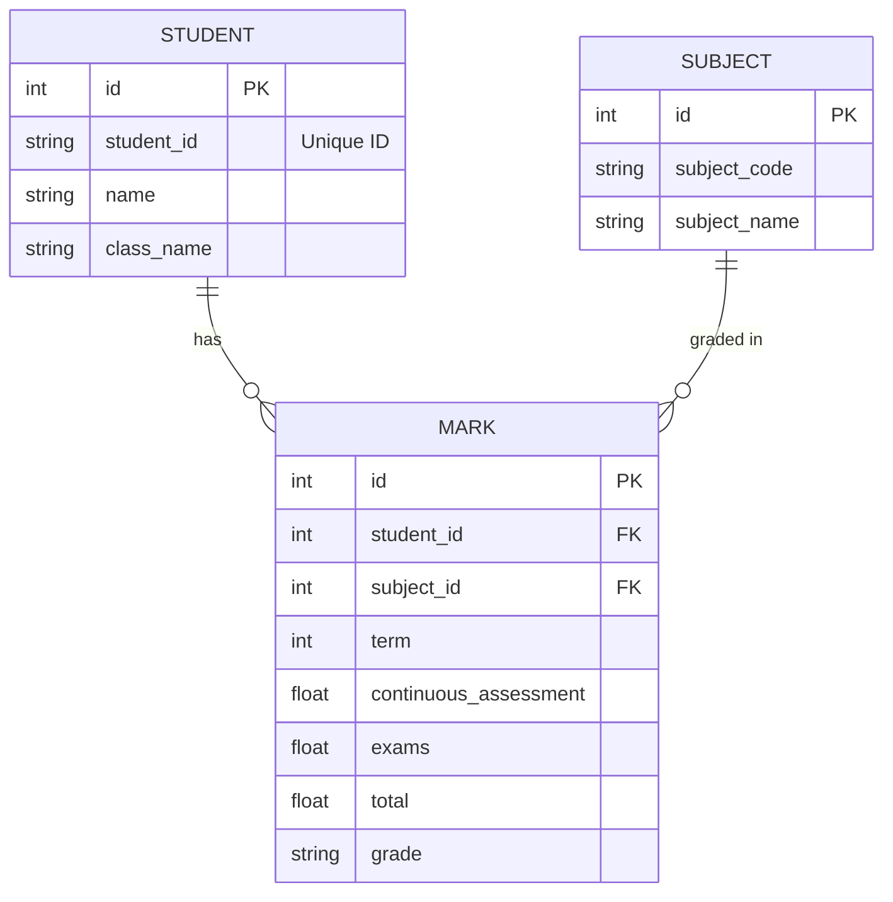

# School Management System - Project Schematics

## 1. Project Overview
This project is a **Desktop-based School Management System** built using Python. It serves as a tool for teachers or administrators to input, manage, and calculate student academic performance (marks, grades, and positions).

### Tech Stack
- **Language**: Python 3
- **GUI Framework**: Tkinter (standard Python GUI library)
- **Database**: SQLite (local file-based database)
- **ORM**: SQLAlchemy (for database interactions)

## 2. Architecture & File Structure
The project follows a modular architecture separating the Presentation (UI), Business Logic, and Data Access layers.

```mermaid
graph TD
    User((User/Admin)) --> UI[forms.py (UI Layer)]
    UI --> Logic[calculations.py (Business Logic)]
    UI --> DBLayer[models.py (Data Layer)]
    Logic --> DBLayer
    Main[main.py (Entry Point)] --> UI
    Main --> DBLayer
    DBLayer --> DB[(school_management.db)]
```

### Components
| File | Role | Description |
|------|------|-------------|
| **`main.py`** | **Entry Point** | Initializes the application, seeds default data (Subjects), and launches the main UI loop. |
| **`forms.py`** | **Presentation Layer** | Handles the Graphical User Interface (GUI). Contains `MarksEntryForm` which allows users to select students, terms, and input marks. |
| **`calculations.py`** | **Business Logic** | Contains the algorithmic core: `GradeCalculator` (grades, averages) and `PositionCalculator` (ranking logic). |
| **`models.py`** | **Data Layer** | Defines the database schema using SQLAlchemy ORM. Maps Python classes to SQLite tables. |
| **`school_management.db`** | **Database** | The binary SQLite file storing all application data. |

## 3. Data Schema (Database)
The database relations are defined in `models.py`.



## 4. Key Workflows

### A. Initialization (`main.py`)
1.  Creates/Connects to `school_management.db`.
2.  Checks if `Subjects` table is empty.
3.  **Seeding**: If empty, populates 20 standard subjects (Math, English, Physics, etc.).
4.  Launches root Tkinter window (`MarksEntryForm`).

### B. Marks Entry (`forms.py`)
1.  **Load**: Fetches all `Students` and `Subjects` to populate the dropdowns and entry grid.
2.  **Input**: User enters CA (Continuous Assessment) and Exam scores.
3.  **Reactive Update**: The UI automatically calculates `Total` (CA + Exam) and updates the `Grade` label in real-time.
4.  **Save**:
    - Checks if a record exists for (Student + Subject + Term).
    - **Update**: If exists, overwrites scores.
    - **Insert**: If new, creates a new `Mark` record.
    - Commits transaction to DB.

### C. Calculations (`calculations.py`)
- **Grading Scale**:
    - **A**: 80-100
    - **B**: 70-79
    - **C**: 60-69
    - **D**: 50-59
    - **F**: 0-49
- **Averages**:
    - Term 1: Simply the Term 1 average.
    - Term 2: Average of (Term 1 Avg + Term 2 Avg).
    - Term 3: Average of (Cumulative Term 2 + Term 3 Avg).
- **Positions**:
    - Sorts students within a class based on their relevant term average.
    - Handles ties (students with same average get same position).

## 5. Scope & Capabilities
- **Supported Operations**:
    - Add/Edit Marks for any of the 20 pre-set subjects.
    - Support for 3 Terms.
    - Automatic Grade Generation.
    - Class Ranking/Positioning.
- **Constraints**:
    - SQLite limitation: best for local/single-user use.
    - Pre-defined Subjects: Adding new subjects requires code/DB intervention (init logic).
    - UI: Fixed grid layout for 20 subjects.
