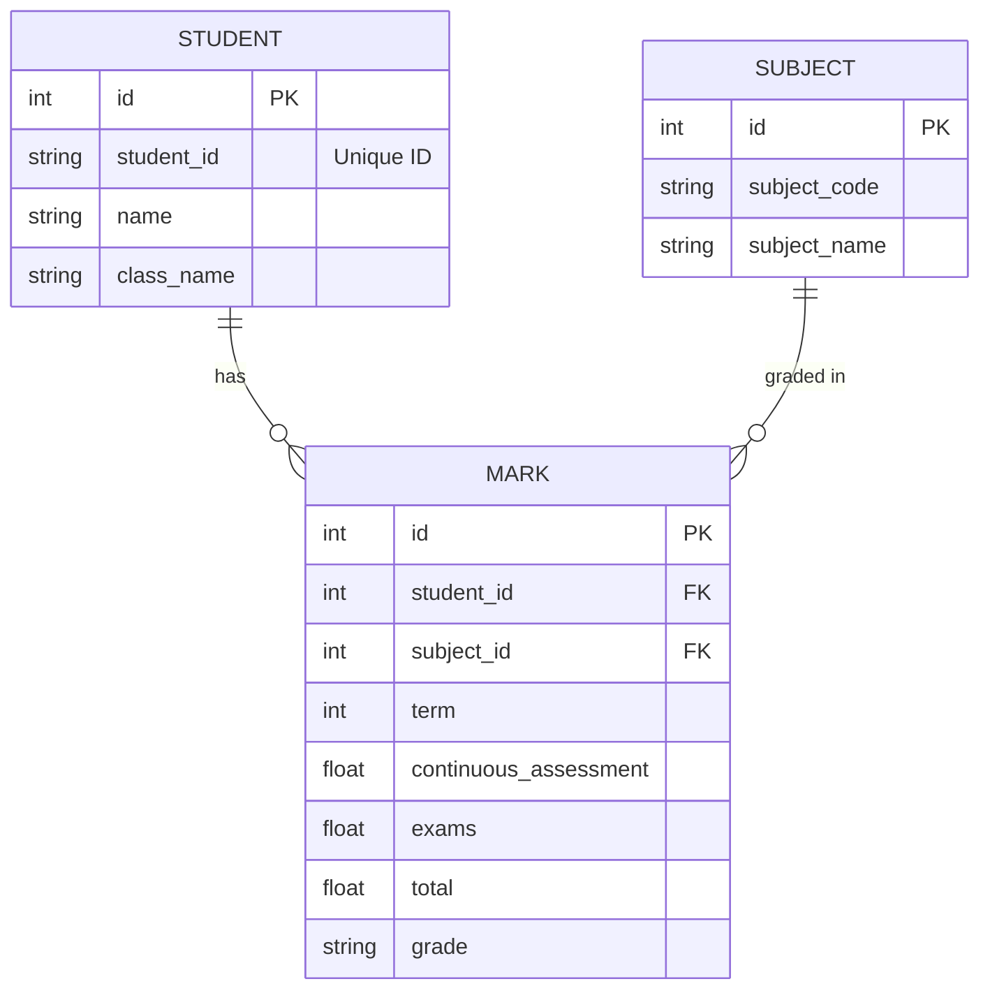
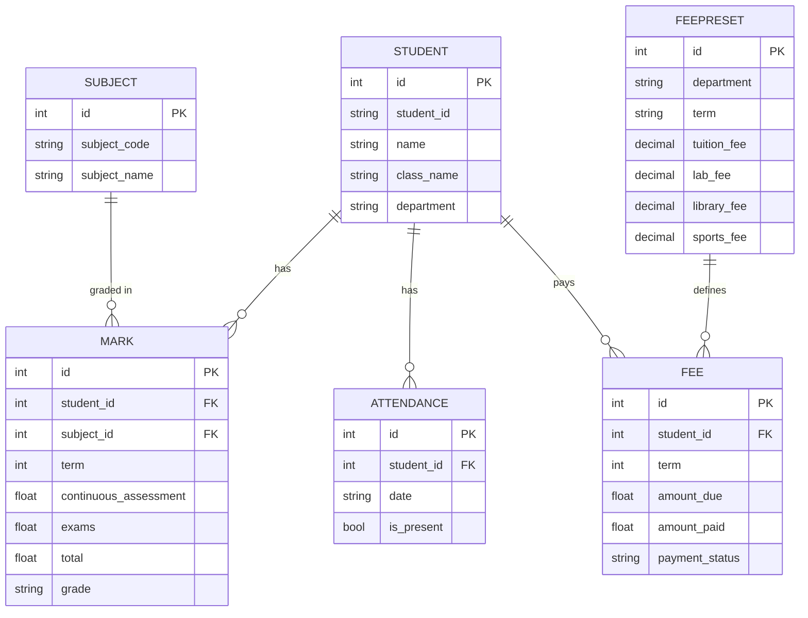
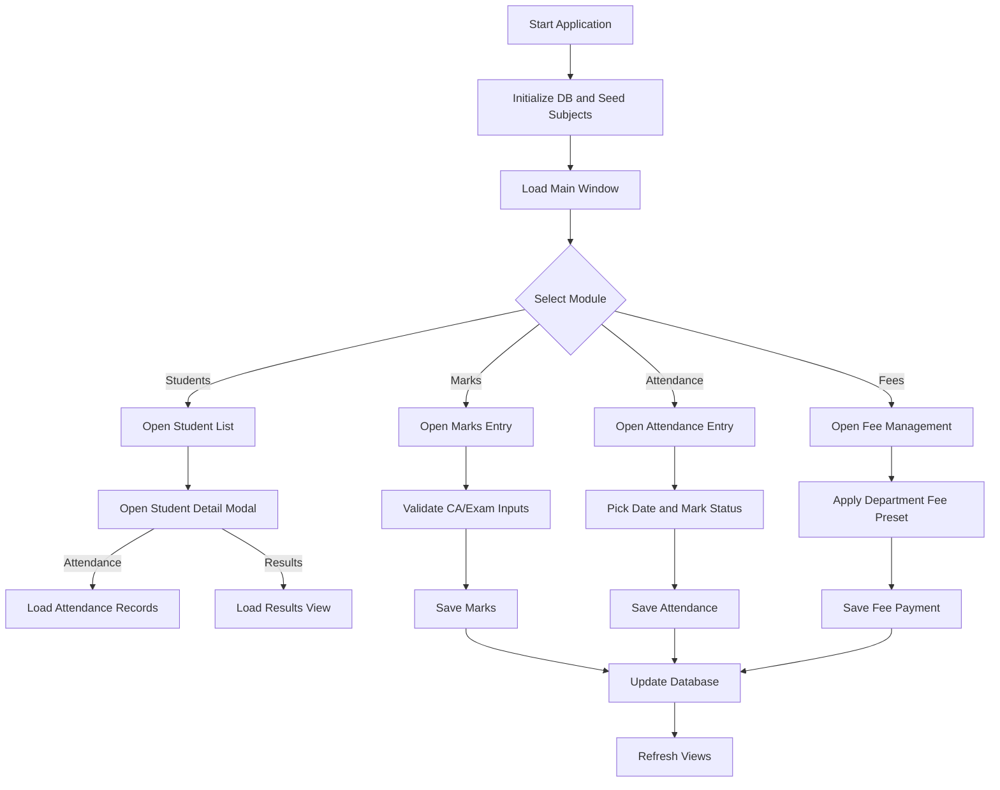

# School Management System - Project Schematics

## 1. Project Overview
This project is a **Desktop-based School Management System** built using Python. It serves as a tool for teachers or administrators to input, manage, and calculate student academic performance (marks, grades, and positions).

### Tech Stack
- **Language**: Python 3
- **GUI Framework**: Tkinter (standard Python GUI library)
- **Database**: SQLite (local file-based database)
- **ORM**: SQLAlchemy (for database interactions)

## 2. Architecture & File Structure
The project follows a modular architecture separating the Presentation (UI), Business Logic, and Data Access layers.

```mermaid
graph TD
    User((User/Admin)) --> UI[forms.py (UI Layer)]
    UI --> Logic[calculations.py (Business Logic)]
    UI --> DBLayer[models.py (Data Layer)]
    Logic --> DBLayer
    Main[main.py (Entry Point)] --> UI
    Main --> DBLayer
    DBLayer --> DB[(school_management.db)]
```

### Components
| File | Role | Description |
|------|------|-------------|
| **`main.py`** | **Entry Point** | Initializes the application, seeds default data (Subjects), and launches the main UI loop. |
| **`forms.py`** | **Presentation Layer** | Handles the Graphical User Interface (GUI). Contains `MarksEntryForm` which allows users to select students, terms, and input marks. |
| **`calculations.py`** | **Business Logic** | Contains the algorithmic core: `GradeCalculator` (grades, averages) and `PositionCalculator` (ranking logic). |
| **`models.py`** | **Data Layer** | Defines the database schema using SQLAlchemy ORM. Maps Python classes to SQLite tables. |
| **`school_management.db`** | **Database** | The binary SQLite file storing all application data. |

## 3. Data Schema (Database)
The database relations are defined in `models.py`.

```mermaid
erDiagram
    STUDENT ||--o{ MARK : "has"
    SUBJECT ||--o{ MARK : "graded in"
    
    STUDENT {
        int id PK
        string student_id "Unique ID"
        string name
        string class_name
    }

    SUBJECT {
        int id PK
        string subject_code
        string subject_name
    }

    MARK {
        int id PK
        int student_id FK
        int subject_id FK
        int term
        float continuous_assessment
        float exams
        float total
        string grade
    }
```

## 4. Key Workflows

### A. Initialization (`main.py`)
1.  Creates/Connects to `school_management.db`.
2.  Checks if `Subjects` table is empty.
3.  **Seeding**: If empty, populates 20 standard subjects (Math, English, Physics, etc.).
4.  Launches root Tkinter window (`MarksEntryForm`).

### B. Marks Entry (`forms.py`)
1.  **Load**: Fetches all `Students` and `Subjects` to populate the dropdowns and entry grid.
2.  **Input**: User enters CA (Continuous Assessment) and Exam scores.
3.  **Reactive Update**: The UI automatically calculates `Total` (CA + Exam) and updates the `Grade` label in real-time.
4.  **Save**:
    - Checks if a record exists for (Student + Subject + Term).
    - **Update**: If exists, overwrites scores.
    - **Insert**: If new, creates a new `Mark` record.
    - Commits transaction to DB.

### C. Calculations (`calculations.py`)
- **Grading Scale**:
    - **A**: 80-100
    - **B**: 70-79
    - **C**: 60-69
    - **D**: 50-59
    - **F**: 0-49
- **Averages**:
    - Term 1: Simply the Term 1 average.
    - Term 2: Average of (Term 1 Avg + Term 2 Avg).
    - Term 3: Average of (Cumulative Term 2 + Term 3 Avg).
- **Positions**:
    - Sorts students within a class based on their relevant term average.
    - Handles ties (students with same average get same position).

## 5. Scope & Capabilities
- **Supported Operations**:
    - Add/Edit Marks for any of the 20 pre-set subjects.
    - Support for 3 Terms.
    - Automatic Grade Generation.
    - Class Ranking/Positioning.
- **Constraints**:
    - SQLite limitation: best for local/single-user use.
    - Pre-defined Subjects: Adding new subjects requires code/DB intervention (init logic).
    - UI: Fixed grid layout for 20 subjects.

# CHAPTER 3 – SYSTEM ANALYSIS AND DESIGN

## 3.1 Analysis of the Existing System

The current system is a desktop-based school management tool focused on marks entry, grading, attendance, and basic fee tracking. It uses a Tkinter/CustomTkinter UI with a single main window and static layouts for student lists and subject marks. Data is stored in a local SQLite database accessed via SQLAlchemy.

Key observations:
- UI is functional but relies on inline views and non-uniform controls, which can clutter the main screen and reduce clarity.
- Marks entry is fixed to a 20-subject grid and uses standard entry widgets without guided defaults.
- Attendance uses text-based date entry, increasing the chance of invalid formats.
- Fee tracking exists per student and term, but lacks department-based fee presets and richer breakdowns.
- The system is best suited for single-user, local operation due to SQLite constraints.

## 3.2 Description/Analysis of the New System

The new system refines the existing solution based on the Kiro UX improvement specifications. It preserves core functionality while introducing a professional, text-based interface and guided workflows. The design emphasizes modular UI components, modal windows for student-specific data, and improved data integrity for fees and attendance.

Major improvements include:
- Professional, text-only controls with consistent typography and spacing.
- Modal-based student detail views for attendance and results to reduce main-screen clutter.
- Fee management with department-specific presets and term-based payment tracking.
- Marks entry with spinbox controls, default maximums (Exam 60, CA 40), and real-time validation.
- Attendance entry using a calendar date picker and validation for academic periods.

## 3.3 System Design

### 3.3.1 Output Design

Outputs are designed to be clear, printable, and consistent with the professional UI theme.

Primary outputs include:
- Student results view (per term) with subject totals, grades, and averages.
- Attendance records view for a selected student with date and status.
- Fee status summary per student per term (paid, partial, pending).
- Optional class-level summaries (positions and averages) generated from calculations.

Output formatting principles:
- Consistent headings, column alignment, and text labels.
- No emoji icons or ambiguous symbols.
- Modal outputs include clear action buttons (Close, Export, Print where applicable).

### 3.3.2 Input Design

Inputs are structured to reduce errors and support fast data entry.

Core inputs:
- Student selection via dropdowns or search-enabled lists.
- Term selection as a fixed dropdown (Term 1, Term 2, Term 3).
- Marks entry using spinboxes with default limits (CA 40, Exam 60).
- Attendance date selection using a calendar date picker widget.
- Fee entry derived from department presets with optional manual adjustments.

Validation rules:
- Marks cannot exceed configured maximums.
- One attendance record per student per date.
- One fee payment per student per term; duplicate prevention enforced.

### 3.3.3 Database Design

The data layer uses SQLAlchemy ORM with SQLite. The new design extends the schema to support fee presets and improved relationships while preserving existing entities.

Core entities:
- Student (student_id, name, class_name, department)
- Subject (subject_code, subject_name)
- Mark (student_id, subject_id, term, continuous_assessment, exams, total, grade)
- Attendance (student_id, date, is_present)
- Fee (student_id, term, amount_due, amount_paid, payment_status)
- FeePreset (department, term, tuition_fee, lab_fee, library_fee, sports_fee)

Key constraints:
- Unique student per student_id.
- Unique marks per student, subject, and term.
- Unique attendance per student per date.
- Unique fee entry per student per term.
- Unique fee preset per department and term.

Proposed ER model:

```mermaid
erDiagram
    STUDENT ||--o{ MARK : "has"
    SUBJECT ||--o{ MARK : "graded in"
    STUDENT ||--o{ ATTENDANCE : "has"
    STUDENT ||--o{ FEE : "pays"
    FEEPRESET ||--o{ FEE : "defines"

    STUDENT {
        int id PK
        string student_id
        string name
        string class_name
        string department
    }

    SUBJECT {
        int id PK
        string subject_code
        string subject_name
    }

    MARK {
        int id PK
        int student_id FK
        int subject_id FK
        int term
        float continuous_assessment
        float exams
        float total
        string grade
    }

    ATTENDANCE {
        int id PK
        int student_id FK
        string date
        bool is_present
    }

    FEE {
        int id PK
        int student_id FK
        int term
        float amount_due
        float amount_paid
        string payment_status
    }

    FEEPRESET {
        int id PK
        string department
        string term
        decimal tuition_fee
        decimal lab_fee
        decimal library_fee
        decimal sports_fee
    }
```

### 3.3.4 System Flowchart

The flowchart below summarizes the primary user workflow from launch to record updates.

```mermaid
flowchart TD
    A[Start Application] --> B[Initialize DB and Seed Subjects]
    B --> C[Load Main Window]
    C --> D{Select Module}
    D -->|Students| E[Open Student List]
    E --> F[Open Student Detail Modal]
    F -->|Attendance| G[Load Attendance Records]
    F -->|Results| H[Load Results View]
    D -->|Marks| I[Open Marks Entry]
    I --> J[Validate CA/Exam Inputs]
    J --> K[Save Marks]
    D -->|Attendance| L[Open Attendance Entry]
    L --> M[Pick Date and Mark Status]
    M --> N[Save Attendance]
    D -->|Fees| O[Open Fee Management]
    O --> P[Apply Department Fee Preset]
    P --> Q[Save Fee Payment]
    K --> R[Update Database]
    N --> R
    Q --> R
    R --> S[Refresh Views]
```
